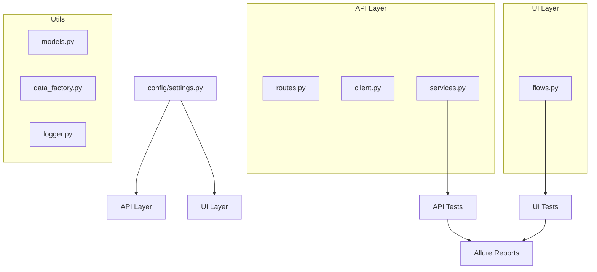

# Fintech Test Automation Framework (Python)

This is a modern and easy‑to‑understand **API + UI automation framework** built using Python.  
The idea is simple: create something clean, scalable, and real — the kind of automation structure a Staff/Senior QE would build and that any team could adopt without confusion.

The framework focuses heavily on:
- **Clarity**
- **Maintainability**
- **DRY (Don’t Repeat Yourself) principles**
- **Modern tooling**
- **Real‑world automation practices**

---

# 🌟 What This Framework Includes

### ✔ API Test Automation
The API layer covers:
- Creating users  
- Fetching user details  
- Creating transactions  
- Listing transactions  
- Negative/validation scenarios  
- Typed request/response validation using `pydantic`
- Async high‑speed execution via `httpx.AsyncClient`  

### ✔ UI Test Automation
Built using **Playwright** with:
- User registration flow  
- Transaction creation flow  
- Field/input validation tests  
- Automatic screenshots on failure  
- Allure‑ready output for reporting  

### ✔ DRY Architecture
No repeated code.  
All shared logic is centralized and reusable:
- service layer  
- data factories  
- UI flows  
- fixtures  
- pydantic models  
- route definitions  

This keeps tests short, readable, and extremely easy to maintain.

---

# 🧱 Tech Stack

| Purpose | Technology |
|--------|------------|
| Language | Python 3.11+ |
| Test runner | pytest |
| Async test support | pytest‑asyncio |
| API client | httpx (async) |
| Config | pydantic‑settings |
| Data models | pydantic v2 |
| UI Automation | Playwright + pytest‑playwright |
| Reporting | Allure |
| Logging | Python logging module |

---

# 📁 Project Structure (Simple Overview)

```
fintech-qe-framework/
├── pyproject.toml
├── pytest.ini
├── README.md
├── config/
│   └── settings.py
├── src/
│   ├── api/
│   │   ├── routes.py
│   │   ├── client.py
│   │   └── services.py
│   ├── ui/
│   │   └── flows.py
│   └── utils/
│       ├── logger.py
│       ├── models.py
│       └── data_factory.py
├── tests/
│   ├── api/
│   │   ├── test_users_api.py
│   │   ├── test_transactions_api.py
│   │   └── test_transactions_validation.py
│   └── ui/
│       └── test_flows_ui.py
├── logs/
└── reports/
```

---

# 🧩 Framework Components Explained.

## 1. config/settings.py  
This is where your environment configuration lives.  
You can set:
- BASE_URL
- UI_URL
- AUTH_TOKEN
- timeouts

It uses `pydantic-settings`, so everything is typed and validated.

---

## 2. src/api/routes.py  
All API routes live here.  
No more repeating '/api/users' in tests.  
One update → everything updates.

---

## 3. src/api/client.py  
Handles real HTTP calls using:
- async httpx client  
- headers  
- logging  
- base URL  
- timeouts  

It keeps network code out of your tests.

---

## 4. src/api/services.py  
This is the “business logic” layer for automation.  
For example:

```python
user = await users_service.create_user(payload)
transactions = await transactions_service.list_for_user(user.id)
```

Tests become clean and flow‑focused.

---

## 5. src/utils/models.py  
Typed pydantic classes for API schemas:
- User
- Transaction
- Create payloads

Your API responses are validated automatically.  
If the API sends the wrong structure → test fails.

---

## 6. src/utils/data_factory.py  
Reusable test data generators:
- `make_user()`
- `make_transaction()`

They create realistic inputs and prevent duplicate payload creation.

---

## 7. src/ui/flows.py  
Reusable Playwright UI steps:
- register user
- create transaction

Update selectors once → all UI tests benefit.

---

## 8. conftest.py  
Framework‑level pytest configuration:
- event loop for async tests  
- ApiClient fixture  
- service fixtures  
- auto-generated user fixture  
- Playwright fixtures  
- screenshots on failure (Allure-compatible)  

---

# 🧰 Prerequisites

You need:

- Python **3.11+**
- pip
- Playwright browsers

Install Playwright browsers:
```
playwright install
```

---

# ⚙️ Setup Instructions

Install all project dependencies:

```
pip install -e .
```

(Optional) Add a `.env` file:

```
BASE_URL=http://localhost:8080
UI_URL=http://localhost:3000
AUTH_TOKEN=
```

---

# ▶️ Running Tests

### Run everything
```
pytest
```

### Run only API tests
```
pytest tests/api
```

### Run only UI tests
```
pytest -m ui
```

### Run tests with Allure reporting
```
pytest --alluredir=reports/allure-results
allure serve reports/allure-results
```

You’ll see:
- full report  
- step-by-step breakdown  
- screenshots for failures  
- API logs  

---

# 🧠 Applying DRY (Don’t Repeat Yourself)

This framework avoids duplicated code everywhere:

### ✔ Route definitions are centralized  
### ✔ Service layer handles API workflows  
### ✔ Data factories create all payloads  
### ✔ UI flows encapsulate selectors, navigation, and actions  
### ✔ Fixtures generate common test objects  
### ✔ Parametrized tests reduce copy‑paste negative tests  

This makes the system extremely future‑proof.

---

# 📈 Extending the Framework

Adding new coverage is simple:

### Add a new API endpoint?
1. Add route → routes.py  
2. Add model → models.py  
3. Add a service method → services.py  
4. Write tests → tests/api  

### Add a new UI flow?
Add steps → flows.py  
Write Playwright tests → tests/ui  

---

# 📊 Architecture Diagram (included for clarity)



---

# ✅ Final Thoughts

This framework is:
- Clean  
- Modern  
- Easy to understand  
- Easy to extend  
- Built with real‑world automation principles  
